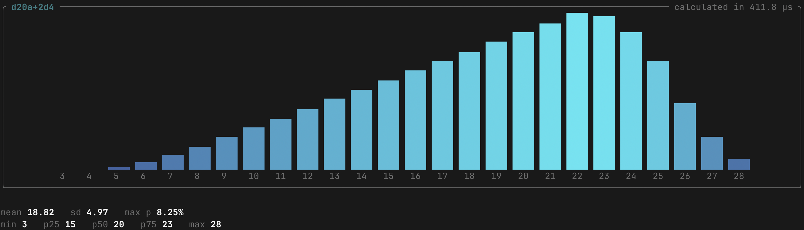

# Probability Distributions for Rolling Dice

[](https://dice.alexkennedy.dev)
[](https://github.com/alex-kennedy/dice/actions/workflows/deploy.yml)
[](LICENSE)



Playing D&D, I became interested in the probability distributions of rolling dice. For example, 2d6+3 means 'roll 2 6-sided dice, sum them, and add 3'.

The repo defines a library and simple site for evaluating expressions like this and computing the complete probability distribution. It's implemented in Rust and exposed as a WebAssembly library. You can try it out at [dice.alexkennedy.dev](https://dice.alexkennedy.dev) (though the UI is currently super basic).

## Expressions

### Dice

Dice of `n` sides are represented by the expression `dn`. For example, `d20` represents a single 20-sided dice.

Rolling `m` such dice and taking the sum of all of them is represented by `mdn`. For example, if you cast a Fireball, you can represent that as usual by `8d6`.

### Advantage, Best, and Worst

You can also represent advantage and disadvantage by using `a` or `d` respectively after the dice term. For example, `d20a` and `d20d` represent rolling two 20-sided dice and taking the best or worst, respectively.

You can also do more arbitrary best or worst groupings. To represent throwing `k` `n`-sided dice, and taking the sum of the `m` best or worst, use `mdnak` or `mdndk`, respectively.

For example, to throw 10 6-sided dice and take the sum of the best 5, you can do `5d6a10`. The number you are adding comes first, and the size of pool comes last.

### Complex Examples

You can add and subtract dice or constants however you like.

- `d20a + d4`: Roll a `d20` with advantage (best of two throws) and add a d4.
- `2(d6d10-7)`: Roll 10 6-sided dice, take the worst, subtract 7 and then double the result.

Multiplying two dice (e.g. `d6*d6`) is not currently supported.

## CLI

This repo contains a CLI for demonstration.

```console
$ cargo run calculate "d20a+2d4"
```

You can also run `simulate` to simulate rolling many dice according to your expression.

```console
$ cargo run simulate --runs=1000000 "d20a+2d4"
```
